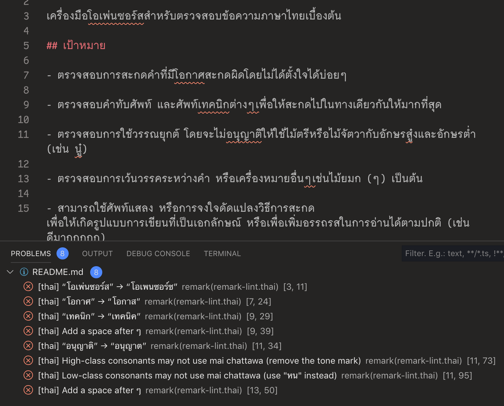
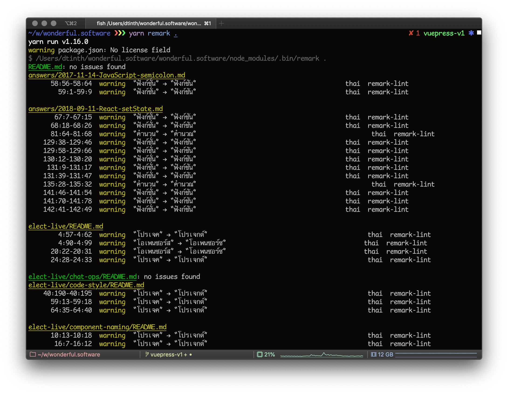

# remark-lint-thai

เครื่องมือโอเพนซอร์ซสำหรับตรวจสอบข้อความภาษาไทยเบื้องต้น



## เป้าหมาย

- ตรวจสอบการสะกดคำที่มีโอกาสสะกดผิดโดยไม่ได้ตั้งใจได้บ่อยๆ

- ตรวจสอบคำทับศัพท์ และศัพท์เทคนิคต่างๆ เพื่อให้สะกดไปในทางเดียวกันให้มากที่สุด

- ตรวจสอบการใช้วรรณยุกต์ โดยจะไม่อนุญาตให้ใช้ไม้ตรีหรือไม้จัตวากับอักษรสูงและอักษรต่ำ

- ตรวจสอบการเว้นวรรคระหว่างคำ หรือเครื่องหมายอื่นๆ เช่นไม้ยมก (ๆ) เป็นต้น

- สามารถใช้ศัพท์แสลง หรือการจงใจดัดแปลงวิธีการสะกด เพื่อให้เกิดรูปแบบการเขียนที่เป็นเอกลักษณ์ หรือเพื่อเพิ่มอรรถรสในการอ่านได้ตามปกติ (เช่น ดีมากกกกก)

## การใช้งาน

### ใช้งานผ่านเว็บ

สามารถใช้งานได้ที่ <https://remark-lint-thai.netlify.com/>

### ใช้งานผ่าน `remark-cli`

`remark-lint-thai` เป็นปลั๊กอินสำหรับ [remark](https://remark.js.org) (ซอฟต์แวร์สำหรับประมวลผลไฟล์ Markdown)
การใช้งานวิธีนี้เหมาะสำหรับกรณีที่เก็บเนื้อหาเป็นไฟล์ชนิด Markdown

การติดตั้งผ่าน Yarn:

```
yarn add --dev remark-cli dtinth/remark-lint-thai
```

หลังจากติดตั้งแล้วสามารถเรียกใช้งานด้วยคำสั่ง:

```
yarn remark .
```


